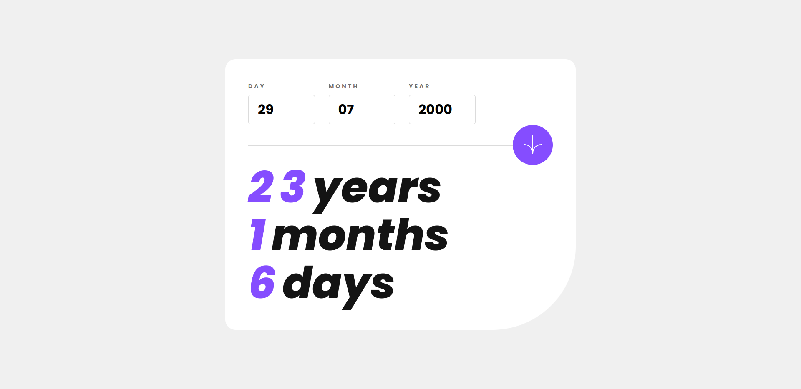

# Frontend Mentor - Age Calculator App



# Description

Thanks for checking out this front-end coding challenge from the [Frontend Mentor](https://www.frontendmentor.io/challenges/age-calculator-app-dF9DFFpj-Q/hub). This component is made with **_Vue_**, **_Scss_** and **_BEM_** methodology. More app previews in src/assets/designs.

## Assets

I used [Poppins](https://fonts.google.com/specimen/Poppins?query=poppins) font family in the following sizes:

- Regular 400 Italic
- Bold 700
- ExtraBold 800 Italic

Color palette is provided by Frontend Mentor:


Color names in src/assets/styles/\_variables.scss.

## Validation

Form valdation includes:

- checking that the fields are not empty
- checking that:
  - day input has 2 signs
  - month input has 2 signs
  - year input has 4 signs
- checking that the date is correct:
  - year is a leap year
  - day has a range: 01-31
  - month has a range 01-12
- checking that the entry date is not a future date

I used this [regex](https://ihateregex.io/expr/date/).

```(regex)
/^(?:(?:31(\/|-|\.)(?:0?[13578]|1[02]))\1|(?:(?:29|30)(\/|-|\.)(?:0?[13-9]|1[0-2])\2))(?:(?:1[6-9]|[2-9]\d)?\d{2})$|^(?:29(\/|-|\.)0?2\3(?:(?:(?:1[6-9]|[2-9]\d)?(?:0[48]|[2468][048]|[13579][26])|(?:(?:16|[2468][048]|[3579][26])00))))$|^(?:0?[1-9]|1\d|2[0-8])(\/|-|\.)(?:(?:0?[1-9])|(?:1[0-2]))\4(?:(?:1[6-9]|[2-9]\d)?\d{2})$/
```

# Credits

Challenge source: [Frontend Mentor](https://www.frontendmentor.io/challenges/age-calculator-app-dF9DFFpj-Q/hub)  
Font source: [Google Fonts](https://fonts.google.com/specimen/Poppins?query=poppins)  
Color palette image: [ColorKit](https://colorkit.co/)  
Regex: [iHateRegex](https://ihateregex.io/expr/date/)  
